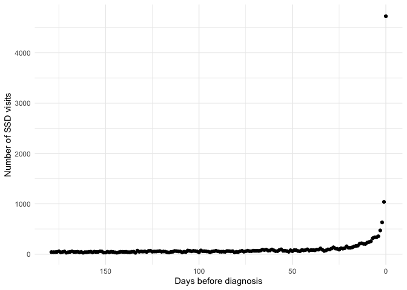
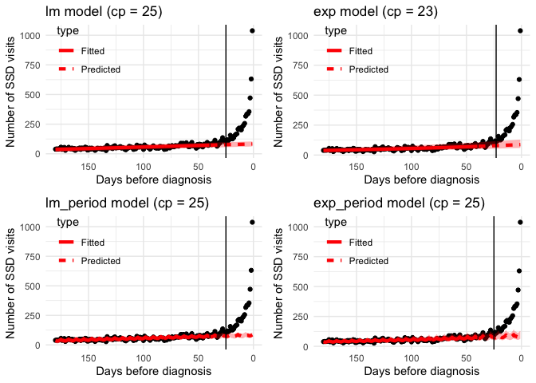
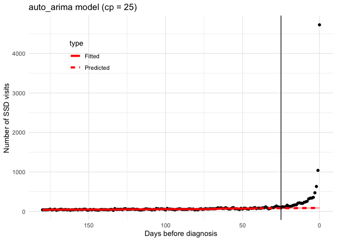
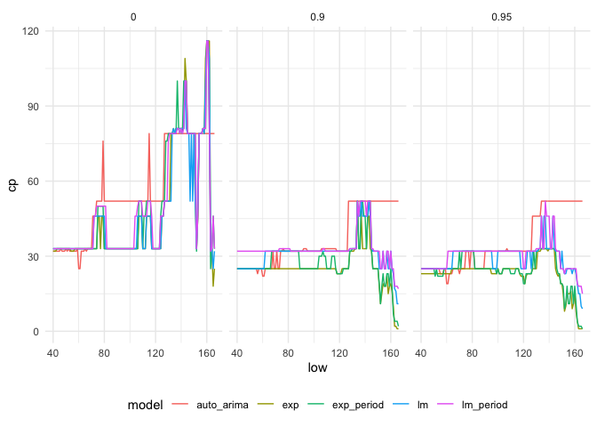

Prediction Bound Change-Point Method
================

## Overview of change-point method

This package contains the scripts necessary to find a change point by
finding the point where the observed data systematically deviate outside
of, and above, the prediction bound of a model fit to a training period
before the diagnostic opportunity window.

The following steps are applied to find the change-point:

1.  Specify the training period \[`low`,`high`\] days prior to
    diagnosis, where `low` is \> the furthest point in the “feasible”
    opportunity window

2.  Fit a model to the data over the period \[`low`,`high`\].

3.  Generate forecasts over the period \[0, `low`-1\] along with a
    corresponding prediction interval

4.  Find the change-point *cp* where the observed number of SSD visits
    exceeds the upper prediction bound for all points *t\<cp* prior to
    diagnosis

## Example

### SSD Visit Count Data

The package contains a count dataset corresponding to SSD visits prior
to HSV encephalitis. The change-point functions require a count dataset
with two variables: `days_since_dx` is the number of days since
diagnosis (negative values before diagnosis) and `n` is the number of
visits

``` r
visit_counts
```

    ## # A tibble: 366 x 2
    ##    days_since_dx     n
    ##            <dbl> <dbl>
    ##  1          -365    48
    ##  2          -364    49
    ##  3          -363    36
    ##  4          -362    34
    ##  5          -361    41
    ##  6          -360    50
    ##  7          -359    32
    ##  8          -358    24
    ##  9          -357    45
    ## 10          -356    33
    ## # … with 356 more rows

The following figure depicts the trend in visit counts prior to HSV
diagnosis, for the 180 days prior to diagnosis

``` r
plot_ssd_curve(count_data = visit_counts,
               max_window = 180)
```

<!-- -->

### Finding a change-point

The main function is `fit_cp_model()`. This function takes an SSD visit
count dataset (*visit\_count*), *low* and *high* values for the training
window, a *model* to fit over the training window, the confidence
*level* for the prediction bound. The function also has an option to
return a plot of the fitted model along with prediction bounds and the
change-point.

The current options for models includes:

  - `lm` - Linear Model
  - `exp` - Exponential Model
  - `lm_period` - Linear Model with 7-day Periodicity
  - `exp_period` - Exponential Model with 7-day Periodicity
  - `auto_arima` - Auto ARIMA Model

<!-- end list -->

``` r
# Linear Model
mod1 <- fit_cp_model(count_data = visit_counts,
                     low = 40, high = 180,      # training window
                     model = "lm",              # model
                     level = .95,               # prediction bound
                     plot = TRUE)

# Exponential Model
mod2 <- fit_cp_model(count_data = visit_counts,
                     low = 40, high = 180,          # training window
                     model = "exp",                 # model
                     level = .95,                   # prediction bound
                     plot = TRUE)

# Linear Model with Periodicity
mod3 <- fit_cp_model(count_data = visit_counts,
                     low = 40, high = 180,          # training window
                     model = "lm_period",           # model
                     level = .95,                   # prediction bound
                     plot = TRUE)

# Exponential Model with Periodicity
mod4 <- fit_cp_model(count_data = visit_counts,
                     low = 40, high = 180,          # training window
                     model = "exp_period",          # model
                     level = .95,                   # prediction bound
                     plot = TRUE)

# Auto ARIMA Model
mod5 <- fit_cp_model(count_data = visit_counts,
                     low = 40, high = 180,          # training window
                     model = "auto_arima",          # model
                     level = .95,                   # prediction bound
                     plot = TRUE)
```

We can compare the results of the different models

``` r
gridExtra::grid.arrange(mod1$plot, mod2$plot,
                        mod3$plot, mod4$plot, 
                        nrow = 2)
```

<!-- -->

``` r
mod5$plot
```

<!-- -->

### Profiling different change-points

The function `fit_cp_profile()` creates a profile of change-points using
a range of different models, training windows and prediction bounds.

``` r
profile_res <- fit_cp_profile(count_data = visit_counts,
                              low = 40,
                              high = 180)
```

We can view the change-points and the results across the various
parameters:

``` r
profile_res
```

    ## # A tibble: 1,905 x 6
    ##      low  high model      bound res                 cp
    ##    <int> <dbl> <chr>      <dbl> <list>           <dbl>
    ##  1    40   180 lm          0    <named list [3]>    33
    ##  2    40   180 lm          0.9  <named list [3]>    25
    ##  3    40   180 lm          0.95 <named list [3]>    25
    ##  4    40   180 exp         0    <named list [3]>    32
    ##  5    40   180 exp         0.9  <named list [3]>    25
    ##  6    40   180 exp         0.95 <named list [3]>    23
    ##  7    40   180 lm_period   0    <named list [3]>    33
    ##  8    40   180 lm_period   0.9  <named list [3]>    32
    ##  9    40   180 lm_period   0.95 <named list [3]>    25
    ## 10    40   180 exp_period  0    <named list [3]>    33
    ## # … with 1,895 more rows

Or we can plot the results across different lower bounds used in the
training data:

``` r
profile_res %>% 
  ggplot2::ggplot(aes(low,cp,color=model)) +
  ggplot2::geom_line() +
  ggplot2::facet_wrap(~bound) +
  ggplot2::theme_minimal() + 
  ggplot2::theme(legend.position="bottom")
```

<!-- -->
